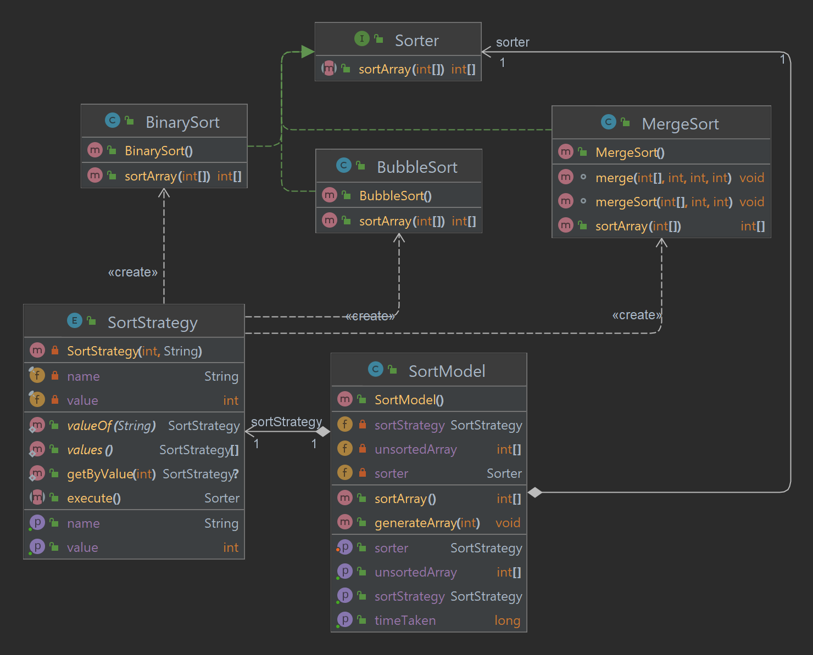
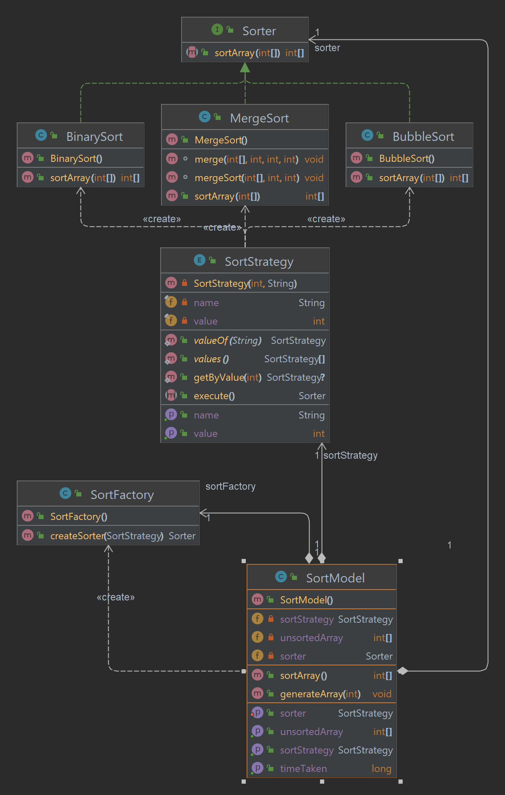
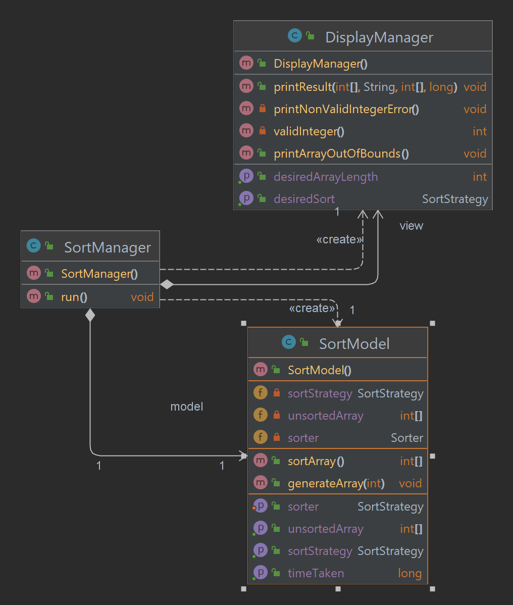
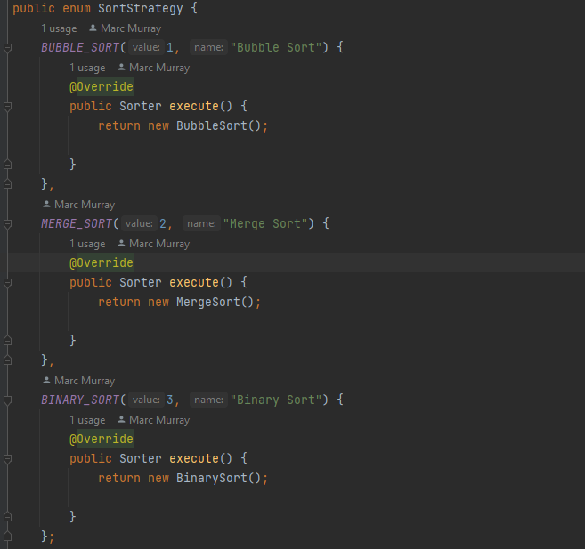

# Sort Manager Project

## Requirements:

You will be building a program that will allow a user to sort a randomised array. The general flow of the application
is:

- The user is presented with a number of sort algorithms to choose from. Decision is given via the command line (using
  Scanner).
- The program will then ask for the length of an array again via the command line.
- The program should then output:
    - The unsorted randomly generated array
    - The sort algorithm to be used
    - The sorted array after the algorithm has been executed
    - The time taken
- You are required to test both the functionality of the program and the performance of the algorithms (speed tests)

# Suggested Project Phases

## Phase 1

- Write a program which will take an array of ints and sort it using a bubble sort algorithm.
- Add the option to use a merge sort algorithm instead.
- Include JUnit tests for this and all subsequent phases (and all subsequent projects for the rest of time).

## Phase 2

- Update your project to use MVC and start to incorporate some of the design principles discussed earlier in the
  course (OOP, SOLID, design patterns).
- Create classes which implements MVC, including SortManager (controller) and DisplayManager (view) classes.
- The code should include a basic factory pattern to determine which sorter to use.
- Make sure packages are created properly and the structure follows the MVC pattern.
    - The code should separate the business logic (sorters) from the display to show MVC in action.
    - display - Classes that deal with printing to the console window.
    - exceptions - Any custom exceptions which will be thrown.
    - sorters - The sort algorithms with Sorter interface for the Factory pattern.
        - binaryTree - Logic for the binary tree including contract interface (see Phase 4).
    - start - Factory pattern for sorters, loader for run logic and Java main method.
- Create an interface which both sort classes can implement and make sure your application uses this interface where
  possible.

## Phase 3

- Add logging code into the Sort Manager project.
- Set up log4j in the project and add a .properties file.
- Create logs at different levels and fully test the resulting output.
- Have output going to a log file created in the resources' directory.
- Ensure there are meaningful log messages added to the project and that they reflect the needs of the levels for which
  they are set.

## Phase 4

- Integrate a new class to implement a tree sort, using a binary search tree, so that the tree sort can be called in the
  same way as the other sort algorithms.
- The new class should implement the current Sorter interface.
- Add code that calls the BST and passes in the array that will be used to construct the tree and then return a sorted
  array.
- Use the Adapter design pattern for this step.
- Implement a nested class to represent a node in the tree.

## Phase 5

- Add timing information to the project and allow the user to select multiple algorithms to compare their performance.

# Running the Application
## Compile
```shell
 javac .\src\main\java\start\Main.java
```

## Run
```shell
java Main.java
```
# Design

## Structure

> java
>
>> model - contains all the main program logic.
>>
>>> binaryTree - contains classes used to represent the binary tree in Binary Sort.
>>
>>> sorts - contains concrete implementations of sort methods and a Sorter interface to use.
>
>> view - contains classes responsible for handling view in MVC model.
>
>> controllers - contains the controller aspect of the MVC model.
>
>> exceptions - contains custom exceptions used in application.
>
>> start - contains Main java method for running the program.

## Patterns Used

### Strategy

The strategy design pattern is a behavioural design pattern that lets you define a family of algorithms, put each of
them into a separate class and make their objects interchangeable at run time.

In the application this is employed by the Sorter Interface along with the concrete implementations of
BubbleSort,MergeSort and BinarySort classes.
In this instance the SortStrategy is the context of the application and that is what chooses which algorithm to Execute.


### Factory

Factory Method is a creational design pattern that provides an interface for creating objects in a superclass, but
allows subclasses to alter the type of objects that will be created.

This was used to instantiate instance of concrete sorting methods. Where the Sorter is your interface and the sort
classes are your concrete implementations. In this instance SortStrategy is actually the creator as when execute is
called in sort strategy it returns a Sorted that is to be used.


### Other Design Decisions

#### MVC Framework

MVC(Model-View-Controller) is a commonly used architecture that involves splitting your application into three main
logical components. For the application i employed this by separating the underlying business logic of the application (
model) away from the user input / output elements of the application (the view). In the case of the application the
DisplayManager class is the view handling all input and output to the terminal, SortModel is the model section of the
application which handles the main crux of Sorting, Timing and random array generation. We also have the SortManager
class which is the controller which mainly handles communication between both of these elements and is also where the
main run loop of the application is held.


#### SortStrategy Enum

In order to reduce the need for multiple points of change when introducing or removing new/old sorting methods i added
the SortStrategy enum class. which holds a value, name and method implementation called execute which returns the Sorter
that is mapped to value and string which is the sort name.


### Improvements that could be made.

- Make the sortArray method in sorting classes static. It wasn't necessary to create an object instance of the class.
  This would have removed the need for the Factory as well.
- More logging, especially at certain entry points for the application.
- More vigorous testing especially on MVC elements of the application.
- Reduce Sort test classes into a single class and test all sorting methods with the same cases.
- Better / more error handling.
